<div align="center">

# Proctor

Run any exam from a JSON or YAML file

[![Live][badge-site]][url-site]
[![HTML5][badge-html]][url-html]
[![CSS3][badge-css]][url-css]
[![JavaScript][badge-js]][url-js]
[![Claude Code][badge-claude]][url-claude]
[![License][badge-license]](LICENSE)

[badge-site]:    https://img.shields.io/badge/live_site-0063e5?style=for-the-badge&logo=googlechrome&logoColor=white
[badge-html]:    https://img.shields.io/badge/HTML5-E34F26?style=for-the-badge&logo=html5&logoColor=white
[badge-css]:     https://img.shields.io/badge/CSS3-1572B6?style=for-the-badge&logo=css3&logoColor=white
[badge-js]:      https://img.shields.io/badge/JavaScript-F7DF1E?style=for-the-badge&logo=javascript&logoColor=black
[badge-claude]:  https://img.shields.io/badge/Claude_Code-CC785C?style=for-the-badge&logo=anthropic&logoColor=white
[badge-license]: https://img.shields.io/badge/license-MIT-404040?style=for-the-badge

[url-site]:   https://proctor.neorgon.com/
[url-html]:   #
[url-css]:    #
[url-js]:     #
[url-claude]: https://claude.ai/code

</div>

---

## Overview

Proctor turns a plain JSON or YAML file into a runnable exam. Drop in questions,
answers, and corrections, then study with instant feedback or sit a timed
simulation with a question palette, flags, and a category score breakdown. The
format fits in an LLM prompt, so any model can generate a test for you -- the
spec ships at `/llms.txt` and behind the Format button.

**Live:** proctor.neorgon.com

---

## Features

- **Four question types** -- single answer, multiple answer, true/false, and typed fill-in
- **Two run modes** -- study (correction after every question) and simulator (timer, flags, submit at the end)
- **Category breakdown** -- per-topic scores on the results screen, plus retake-missed-only
- **JSON, YAML, Aiken, GIFT, CSV** -- built-in parsers for all five, no dependencies, JSON is canonical; Moodle exports and spreadsheets drop straight in
- **Draw N** -- run a random slice of a big bank; questions marked `ensure: true` always make the cut
- **Progress** -- score trend per test (sparkline, best/last), latest category breakdown, and recent-run history -- all from localStorage
- **Results export** -- per-question CSV (your answer, the correct one, category, points) from the results screen
- **LLM-ready format** -- one-click prompt copy; paste the model's output straight back in
- **Share links** -- a whole test travels in the URL fragment, nothing touches a server
- **Review mode** -- every question fully rendered with the answer key and the why, paginated at your pace (5/10/20/all per page); hide the wrong options for a compact answer sheet, and share the whole test from the same toolbar
- **Markdown everywhere** -- prompts, options, explanations, and notes render a safe subset: fenced code blocks, inline code, bold, italic, links, lists
- **Notes and PDF** -- annotate any question with markdown notes (rendered in place, click to edit), then export the whole test (answers, corrections, notes) to PDF via the print dialog
- **Embeddable** -- one iframe snippet runs a full test inside any other site or tool (`?embed=1&mode=study#t=...`), chromeless and stateless; Review has a Copy embed code button
- **Local by design** -- tests, sessions, notes, and history live in localStorage only; embed runs write nothing at all

---

## The test format

```json
{
  "title": "Terminal Basics",
  "timeLimitMinutes": 10,
  "passingScore": 70,
  "questions": [
    {
      "type": "single",
      "category": "files",
      "prompt": "Which command lists hidden files too?",
      "options": ["ls", "ls -a", "ls -s"],
      "answer": 1,
      "explanation": "-a includes entries starting with a dot"
    }
  ]
}
```

Full field reference: [`llms.txt`](llms.txt) or the in-app Format page.

---

## Running locally

ES modules require an HTTP server (not `file://`):

```bash
make serve    # http://localhost:8861
```

---

## Architecture



```
proctor-site/
├── index.html          # App shell: library, runner, results, format views
├── llms.txt            # The test-format spec, written for LLMs
├── css/style.css       # Site styles over CDN base tokens
├── data/               # Sample tests (one JSON, one YAML on purpose)
└── js/
    ├── app.js          # Entry point: restore, samples, #t= and ?src= import, embed boot
    ├── state.js        # Tests, session, history in localStorage
    ├── md.js           # Markdown subset renderer (escape-first, no deps)
    ├── formats.js      # Aiken, GIFT-subset, and CSV importers
    ├── parser.js       # JSON + YAML-subset parsing, normalization, validation
    ├── grader.js       # Per-type grading + session summary
    ├── timer.js        # Simulator countdown
    ├── render.js       # All view rendering
    └── events.js       # Session lifecycle, import pipeline, keyboard
```

---

<div align="center">
<sub>Part of <a href="https://neorgon.com/">Neorgon</a></sub>
</div>
